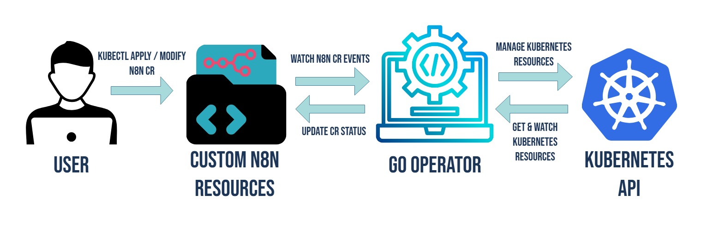

# n8n Kubernetes Operator
*Automated Deployment and Management of n8n Instances on Kubernetes*

---

## Table of Contents
1.  [Overview](#overview)
2.  [Architecture at a Glance](#architecture-at-a-glance)
3.  [Core Features & Functionality](#core-features--functionality)
    1.  [Automated Resource Provisioning](#automated-resource-provisioning)
    2.  [Dynamic Configuration & Self-Healing](#dynamic-configuration--self-healing)
    3.  [Health Monitoring & Status Reporting](#health-monitoring--status-reporting)
    4.  [Multi-Instance Isolation](#multi-instance-isolation)
4.  [Key Achievements](#key-achievements)
5.  [Future Roadmap](#future-roadmap)

---

## Overview
Deploying the n8n workflow automation platform typically requires manually creating and configuring over eight distinct Kubernetes resources, including deployments, services, persistent volumes, and secrets for both n8n and its PostgreSQL database. This process is not only tedious but also prone to configuration errors.

The **n8n Kubernetes Operator** was built to solve this problem. It abstracts away the complexity, enabling the deployment of a complete, production-ready n8n instance with a single, declarative YAML file. What once was a multi-step, manual task is now as simple as:

> `kubectl apply -f example/development-n8n.yaml`

The operator handles the rest, turning a complex infrastructure challenge into a streamlined, automated, and reliable process.

---

## Architecture at a Glance
The operator extends the Kubernetes API by introducing a Custom Resource Definition (CRD), `N8nInstance`. When a user creates an `N8nInstance` resource, the operator's control loop is triggered. It continuously monitors the state of the cluster and works to reconcile the current state with the desired state defined in the custom resource. This ensures all necessary components are created, configured, and maintained correctly.

*The operator watches for N8nInstance events and manages the lifecycle of associated Deployments, Services, PVCs, and Secrets.*

---

## Core Features & Functionality

### Automated Resource Provisioning
When an `N8nInstance` resource is created, the operator automatically provisions and configures a complete, isolated environment. This includes:
-   **PostgreSQL Database:** A dedicated database deployment with a PersistentVolumeClaim (PVC) for durable storage.
-   **n8n Application:** An n8n deployment, also with its own PVC to persist workflow data.
-   **Secrets Management:** Automatically generates and manages secrets for database credentials, ensuring secure communication between n8n and PostgreSQL.
-   **Networking:** Creates the necessary services for internal cluster communication and an optional Ingress resource for secure external access.

### Dynamic Configuration & Self-Healing
The operator actively manages the deployed resources throughout their lifecycle.
-   **Self-Healing:** If any managed resource (like a Deployment or Service) is deleted or modified, the operator’s reconciliation loop will automatically detect the drift and recreate or correct the resource to match the desired state.
-   **Configuration Updates:** Changes made to the `N8nInstance` spec, such as updating the n8n version or scaling the number of replicas, are automatically applied to the corresponding deployments without manual intervention.

### Health Monitoring & Status Reporting
The operator provides real-time visibility into the health and status of each n8n instance directly within the custom resource.
-   **Health Conditions:** The `status` field is updated with `Ready`, `N8nReady`, and `PostgresReady` conditions, giving a clear indication of the instance's health.
-   **Access Information:** The status conveniently provides ready-to-use access URLs and `kubectl port-forward` commands, making it easy to connect to the n8n UI.

### Multi-Instance Isolation
The operator is designed to manage multiple n8n instances within the same cluster, with each instance being completely isolated in its own namespace. This allows for separate environments for development, staging, and production, all managed by the same operator.

---

## Key Achievements
-   **Mastered the Operator Pattern:** Gained a deep understanding of how Kubernetes operators work, including reconciliation loops, self-healing capabilities, and extending the Kubernetes API with CRDs.
-   **Simplified Complex Deployments:** Successfully abstracted a multi-component infrastructure setup into a single, easy-to-use custom resource, drastically reducing deployment time and the potential for human error.
-   **Built-in Status & Health Monitoring:** Implemented robust health checks and status reporting, providing crucial visibility into the state of complex, multi-resource deployments.
-   **End-to-End Automation:** Developed a system that handles the complete lifecycle of n8n, from initial provisioning and configuration to updates and healing, allowing developers to focus on building workflows rather than managing infrastructure.

---

## Future Roadmap
The following enhancements are planned to make the operator even more powerful and production-ready.

#### Monitoring & Observability
-   **Prometheus Integration:** Expose custom metrics for n8n instances and workflows.
-   **Grafana Dashboards:** Provide pre-configured dashboards for monitoring.
-   **Alerting:** Implement alerts for failed workflows or high resource usage.

#### GitOps & CI/CD
-   **ArgoCD Integration:** Enable GitOps-driven management of n8n instances.
-   **Helm Charts:** Package the operator as a Helm chart for easy distribution and installation.
-   **Automated Pipelines:** Create GitHub Actions for automated testing and deployment of the operator itself.

#### Advanced Features
-   **Backup & Restore:** Introduce capabilities for automated backups and restoration of the PostgreSQL database.
-   **Auto-scaling:** Automatically scale n8n instances based on workflow execution load.
-   **Multi-tenancy:** Enhance isolation to support secure multi-tenant deployments.

#### Security & Compliance
-   **RBAC Integration:** Implement fine-grained, per-instance role-based access control.
-   **Network Policies:** Automatically create NetworkPolicies for strict network isolation.
-   **External Secret Management:** Integrate with tools like HashiCorp Vault or AWS Secrets Manager.

#### Developer Experience
-   **CLI Tool:** Develop an `n8n-operator` CLI for simplified management.
-   **Web UI:** Create a simple dashboard for visualizing and managing instances.
-   **Templates:** Offer pre-built `N8nInstance` configurations for common use cases.